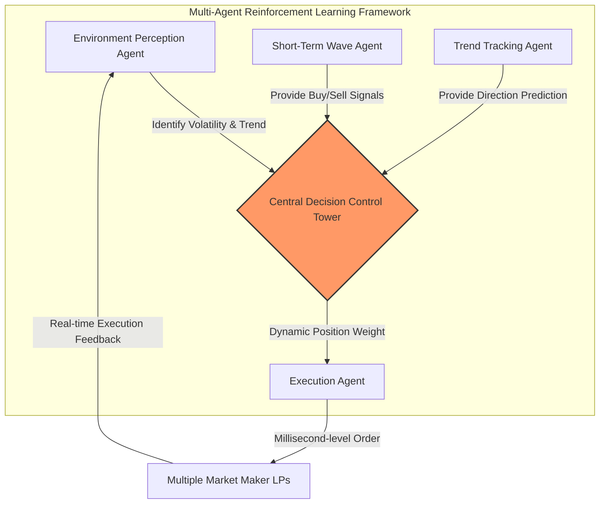

# ReinforceTrade

[](https://www.python.org/)
[](rust/)
[](dashboard/)
[](monitor/)
[](Dockerfile)
[](LICENSE)

An AI-powered quantitative trading system featuring a **Multi-Agent Reinforcement Learning Framework** with multi-language components for high performance, real-time monitoring, and transparent decision-making.

## Overview

ReinforceTrade is a Python-based algorithmic trading platform that combines multiple specialized AI agents to make intelligent trading decisions. Unlike traditional black-box trading systems, ReinforceTrade provides complete transparency into its decision-making process through detailed visualizations and comprehensive backtest reports.

## Key Features

- **Multi-Agent Architecture**: Three specialized agents (Environment, Short-Term, Trend) work together under a central Decision Tower
- **Reinforcement Learning**: RL agents continuously improve through self-reinforcement using Stable Baselines3
- **Risk Management**: Advanced risk controls including dynamic position sizing and stop-loss mechanisms
- **Transparent Reporting**: Visual backtest reports showing every decision made by the system
- **Strategy Optimization**: Grid search and genetic algorithm optimization with walk-forward validation

## System Architecture

### Multi-Agent Framework



**How It Works:**

1. **Environment Perception Agent (A)**: Continuously monitors market conditions, identifying volatility patterns and overall market trends.

2. **Short-Term Wave Agent (C)**: Focuses on high-frequency trading opportunities, providing specific buy/sell signals based on momentum indicators.

3. **Trend Tracking Agent (D)**: Provides macro-level direction predictions using longer-term moving averages and trend analysis.

4. **Central Decision Control Tower (B)**: The brain of the system. It aggregates intelligence from all three agents, weighs their signals based on current market conditions, and makes the final trading decision including position sizing.

5. **Execution Agent (E)**: Receives orders from the Control Tower and executes them through trading APIs with millisecond-level precision.

6. **Reinforcement Learning Loop**: Order execution results (prices, slippage, latency) are fed back to the Environment Perception Agent, allowing the AI system to continuously evaluate and improve its decisions.

## Entry Logic & Protection Mechanisms

### Entry Conditions

The system enters a position only when:
- **Confidence Threshold**: The Decision Tower's confidence score exceeds 60% (configurable)
- **Agent Consensus**: At least 2 out of 3 agents signal the same direction
- **Risk Limits**: Position size does not exceed exposure limits

### Stop Loss & Take Profit

- **Dynamic Stop Loss**: Adjusted based on market volatility (default: 5%, increases to 7.5% in high volatility)
- **Take Profit**: Set at 10% by default
- **Reversal Detection**: System exits immediately if opposite signal with high confidence detected

### Risk Management

- **Position Sizing**: Kelly Criterion-based sizing with confidence scaling
- **Exposure Limits**: Maximum 10% of portfolio per trade, 20% per symbol
- **Consecutive Loss Protection**: Reduces exposure after 3 consecutive losses
- **Drawdown Control**: Hard stop at 20% maximum drawdown

## Technology Stack

| Language | Component | Purpose |
|:--------:|:----------|:--------|
| Python | Core engine, Agents, Strategies, Backtesting, Trading, ML, Monitoring, Web | System orchestration & business logic |
| Rust | High-performance data engine (`rust/`, PyO3 FFI) | Batch OHLCV aggregation, financial metrics |
| TypeScript | Real-time dashboard (`dashboard/`, WebSocket) | Live P&L, positions, and trade monitoring |
| Go | Monitoring agent (`monitor/`) | Prometheus metrics collection |
| Shell | Ops scripts & CI/CD (`scripts/`, `.github/`) | Automation & deployment |
| Dockerfile | Containerization | Multi-stage build + docker-compose |

## Backtesting

### Enhanced Backtest Engine

Our backtester provides:
- **Realistic Simulation**: Includes transaction costs and slippage
- **Walk-Forward Validation**: Prevents overfitting by testing on out-of-sample data
- **Comprehensive Metrics**: Sharpe ratio, Calmar ratio, profit factor, win rate
- **Visual Reports**: HTML reports with equity curves, drawdown analysis, and trade distributions

### Transparency Features

Every backtest report includes:
- Individual agent signals at key decision points
- Decision rationale and confidence scores
- Risk metrics and exposure tracking
- Comparison of in-sample vs out-of-sample performance

## Quick Start

### Installation

```bash
# Clone the repository
git clone https://github.com/EthanWalkerSV/ReinforceTrade.git
cd reinforcetrade

# Install dependencies
pip install -r requirements.txt

# Set up environment variables
cp .env.example .env
# Edit .env with your API keys
```

### Basic Usage

```python
from data import DataLoader
from agents import TrainingPipeline
from strategies import MultiAgentStrategy
from backtesting import EnhancedBacktester

# Load data
data_loader = DataLoader()
data = data_loader.fetch_historical_data('BTC/USDT', timeframe='1h', limit=5000)

# Train RL agents
pipeline = TrainingPipeline(agent_type='ppo')
pipeline.train_on_exchange_data('BTC/USDT', total_timesteps=50000)

# Run backtest
strategy = MultiAgentStrategy(use_rl=True)
backtester = EnhancedBacktester(strategy, initial_balance=10000)
results = backtester.run(data)

# Generate report
from reports import ReportGenerator
report_gen = ReportGenerator()
report_dir = report_gen.generate_full_report(results)
```

## Documentation

- [Architecture Overview](docs/architecture.md) - Detailed system architecture and component interactions
- [Getting Started](docs/getting_started.md) - Step-by-step setup and first run guide
- [API Reference](docs/api_reference.md) - Complete API documentation
- [Transparency & Trust](docs/transparency.md) - How we ensure transparency in AI decisions

## Project Structure

```
ReinforceTrade/
├── agents/                 # Multi-agent RL framework (Environment, Short-Term, Trend, DecisionTower, Execution)
├── strategies/             # Trading strategies & risk management (base, multi-agent, risk manager)
├── backtesting/            # Backtest engine with enhanced backtester and walk-forward validation
├── environments/           # OpenAI Gym trading environments for RL training
├── trading/                # Exchange interfaces & real-time trading system
│   ├── exchange.py         # Abstract Exchange base class
│   ├── ccxt_exchange.py    # CCXT multi-exchange adapter (Binance, Coinbase, etc.)
│   ├── ib_adapter.py       # Interactive Brokers TWS/Gateway adapter
│   ├── oanda_adapter.py    # OANDA REST API adapter
│   ├── broker_factory.py   # Unified broker adapter factory
│   ├── websocket_client.py # Real-time market data streams
│   ├── order_manager.py    # Order lifecycle management
│   ├── position_tracker.py # Real-time position & P&L tracking
│   ├── monitor.py          # Trade monitoring engine
│   └── alert_channel.py    # Multi-channel alert dispatch
├── ml/                     # ML factor engine (sklearn-powered signals)
│   ├── ml_factor.py        # Pipeline wrapper, walk-forward CV, router
│   ├── momentum_factor.py  # ROC, MACD, RSI momentum signals
│   ├── volatility_factor.py# ATR, regime classification, weight multiplier
│   ├── sentiment_factor.py # Volume trend, buy/sell pressure proxy
│   └── factor_pipeline.py  # Weighted composite signal pipeline
├── rust/                   # Rust high-performance data engine (PyO3 FFI)
│   ├── Cargo.toml          # Rust project manifest
│   └── src/lib.rs          # OHLCV aggregation, statistics, financial metrics
├── dashboard/              # TypeScript real-time WebSocket dashboard
│   ├── package.json        # npm project config
│   ├── tsconfig.json       # TypeScript compiler config
│   ├── index.ts            # Dashboard logic (tables, charts, WebSocket)
│   └── style.css           # Dark-theme responsive styles
├── monitor/                # Go monitoring agent (Prometheus metrics)
├── web/                    # Flask web panel & monitoring dashboard
├── sql/                    # PostgreSQL/SQLite schemas & stored procedures
│   ├── init.sql            # Schema, indexes, and 6 stored procedures
│   └── analysis_queries.sql# Complex analytical queries (10 queries)
├── scripts/                # Shell/PowerShell automation scripts
├── .github/workflows/      # CI/CD pipelines (ci.yml, release.yml)
├── docs/                   # Architecture, API reference, getting started, transparency
├── tests/                  # Unit and integration tests (14 test files)
├── examples/               # Usage examples for all modules
├── Dockerfile              # Multi-stage build (Rust → Go → Python)
└── docker-compose.yml      # 5-service orchestrated deployment
```
ReinforceTrade/
├── agents/                 # Multi-agent system
│   ├── base_agent.py
│   ├── environment_agent.py
│   ├── short_term_agent.py
│   ├── trend_agent.py
│   ├── decision_tower.py
│   ├── rl_agent.py
│   └── training_pipeline.py
├── strategies/             # Trading strategies
│   ├── base_strategy.py
│   ├── multi_agent_strategy.py
│   └── risk_manager.py
├── backtesting/            # Backtest engine
│   ├── backtester.py
│   └── enhanced_backtester.py
├── environments/           # RL environments
│   └── trading_env.py
├── data/                   # Data loading and preprocessing
│   └── data_loader.py
├── trading/                # Exchange interfaces
│   └── exchange.py
├── reports/                # Report generation
│   └── report_generator.py
├── optimization/           # Strategy optimization
│   ├── strategy_optimizer.py
│   └── walk_forward_validation.py
├── utils/                  # Utilities
│   └── logger.py
├── config/                 # Configuration
│   └── settings.py
├── docs/                   # Documentation
└── tests/                  # Unit tests
```

## Self-Reinforcement Process

The system continuously improves through:

1. **Experience Collection**: Every trade's outcome is recorded
2. **Performance Analysis**: Win/loss patterns are analyzed by agent
3. **Model Updates**: RL models are periodically retrained on new data
4. **Hyperparameter Tuning**: Strategy parameters are optimized using genetic algorithms
5. **Validation**: Walk-forward validation ensures improvements generalize to new data

## Safety & Risk Controls

- **Circuit Breakers**: Automatic trading halt on extreme volatility
- **Maximum Drawdown**: Hard stop at 20% portfolio loss
- **Position Limits**: Prevents over-concentration in single assets
- **API Safety**: Rate limiting and error handling for all exchange operations

## License

MIT License - See LICENSE file for details.

## Disclaimer

This software is for educational and research purposes only. Trading cryptocurrencies involves substantial risk of loss. Past performance does not guarantee future results. Always conduct thorough backtesting and risk assessment before using with real capital.

## Contact

For questions or support, please open an issue on GitHub or contact the development team.

---

**ReinforceTrade**: Building trust through transparency in AI-powered trading.
