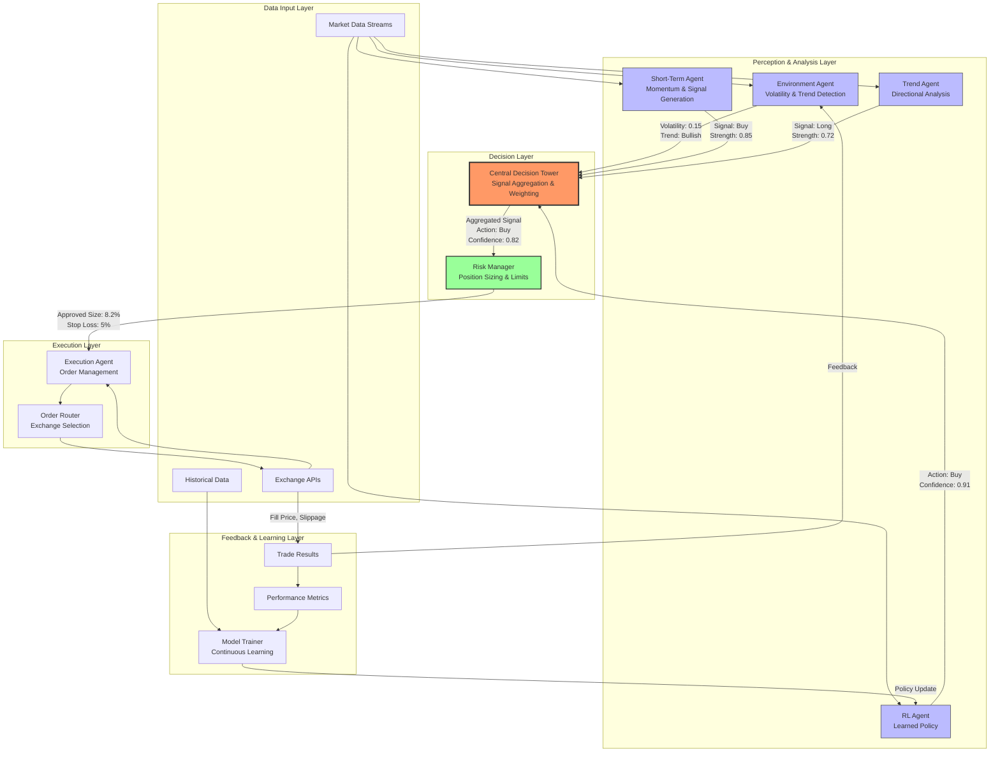
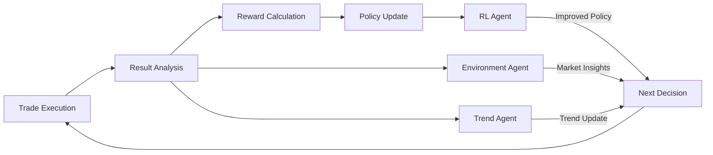

# ReinforceTrade Architecture Documentation

## System Overview

ReinforceTrade employs a **Multi-Agent Reinforcement Learning Framework** that mimics the decision-making process of professional trading teams. The system consists of specialized agents, each with distinct responsibilities, coordinated by a central decision-making authority.

## Macro Architecture Diagram



## Component Breakdown

### 1. Perception & Analysis Agents

#### Environment Perception Agent

**Responsibility**: Monitor overall market conditions and context.

**Inputs**:
- Price data (OHLCV)
- Volume profiles
- Market volatility measures

**Outputs**:
```python
{
    "volatility": 0.15,        # Current market volatility (0-1 scale)
    "trend": "bullish",        # Market trend direction
    "regime": "trending",      # Market regime (trending/ranging/volatile)
    "market_health": 0.82      # Overall market condition score
}
```

**Logic**:
- Calculates historical volatility using standard deviation of returns
- Determines trend using moving average crossovers
- Identifies market regime through volatility clustering

#### Short-Term Wave Agent

**Responsibility**: Identify short-term trading opportunities using momentum indicators.

**Inputs**:
- Short-term price movements (1m to 1h timeframes)
- Order flow data
- Volume momentum

**Outputs**:
```python
{
    "signal": "buy",           # Trading signal
    "strength": 0.85,          # Signal confidence (0-1)
    "momentum": 0.03,          # Measured momentum
    "entry_zone": [45000, 45500],  # Suggested entry range
    "timeframe": "1h"          # Validity period
}
```

**Logic**:
- Uses rate-of-change (ROC) and momentum oscillators
- Identifies support/resistance breakouts
- Measures volume confirmation

#### Trend Tracking Agent

**Responsibility**: Provide macro-level directional bias.

**Inputs**:
- Longer-term price data (4h to daily)
- Moving averages and trend indicators
- Market structure analysis

**Outputs**:
```python
{
    "signal": "long",          # Directional bias
    "strength": 0.72,          # Trend strength (0-1)
    "trend_duration": "medium", # Short/medium/long-term
    "support_levels": [42000, 40000],
    "resistance_levels": [48000, 50000]
}
```

**Logic**:
- Multiple timeframe analysis (MTF)
- Moving average trend alignment
- Support/resistance zone detection

#### RL Agent

**Responsibility**: Learn optimal trading policies through reinforcement learning.

**Inputs**:
- Market state features
- Position information
- Historical performance

**Outputs**:
```python
{
    "action": 1,               # 0=hold, 1=buy, 2=sell
    "confidence": 0.91,        # Policy confidence
    "expected_reward": 0.025,  # Predicted return
    "state_value": 1.15        # Value function estimate
}
```

**Logic**:
- Trained using PPO (Proximal Policy Optimization) or A2C
- Policy network maps states to actions
- Continuous learning from live trading feedback

### 2. Central Decision Control Tower

**Responsibility**: Aggregate agent signals and make final trading decisions.

**Signal Aggregation Algorithm**:

```python
def aggregate_signals(agent_signals: Dict) -> Dict:
    """
    Weighted voting system with confidence scaling.
    """
    # Weight assignment based on current market regime
    weights = {
        'EnvironmentAgent': 0.20,   # Context is important
        'ShortTermAgent': 0.25,     # Timing is crucial
        'TrendAgent': 0.25,         # Direction matters
        'RLAgent': 0.30             # Learned behavior
    }
    
    # Calculate weighted scores
    buy_score = 0
    sell_score = 0
    hold_score = 0
    
    for agent, signal in agent_signals.items():
        action = signal['signal']  # buy/sell/hold/long/short
        strength = signal['strength']
        weight = weights.get(agent, 0.25)
        
        if action in ['buy', 'long']:
            buy_score += strength * weight
        elif action in ['sell', 'short']:
            sell_score += strength * weight
        else:
            hold_score += strength * weight
    
    # Normalize scores
    total = buy_score + sell_score + hold_score
    
    # Decision logic
    if buy_score > sell_score and buy_score > hold_score:
        action = "buy"
        confidence = buy_score / total
    elif sell_score > buy_score and sell_score > hold_score:
        action = "sell"
        confidence = sell_score / total
    else:
        action = "hold"
        confidence = hold_score / total
    
    return {
        "action": action,
        "confidence": confidence,
        "scores": {
            "buy": buy_score,
            "sell": sell_score,
            "hold": hold_score
        }
    }
```

**Dynamic Weight Adjustment**:
- In trending markets: Increase TrendAgent weight
- In volatile markets: Increase EnvironmentAgent weight
- In ranging markets: Increase ShortTermAgent weight
- RLAgent weight increases as it accumulates more training

### 3. Risk Management System

**Responsibility**: Ensure trading decisions respect risk limits.

**Position Sizing Formula** (Kelly Criterion Modified):

```python
def calculate_position_size(
    balance: float,
    confidence: float,
    volatility: float,
    max_risk_per_trade: float = 0.01
) -> float:
    """
    Position size = (Balance × Risk% × Confidence) / (Volatility × Scaling)
    """
    # Kelly fraction (conservative half-Kelly)
    kelly_fraction = 0.5
    
    # Base position size
    risk_amount = balance * max_risk_per_trade
    base_size = risk_amount * kelly_fraction
    
    # Confidence scaling (higher confidence = larger size)
    confidence_multiplier = min(confidence * 1.5, 1.0)
    
    # Volatility adjustment (higher vol = smaller size)
    vol_multiplier = max(0.5, 1 - volatility)
    
    # Final calculation
    position_size = base_size * confidence_multiplier * vol_multiplier
    
    # Cap at max position (10% of balance)
    max_position = balance * 0.10
    
    return min(position_size, max_position)
```

**Risk Checks**:

1. **Single Position Limit**: Max 10% of portfolio per trade
2. **Symbol Exposure Limit**: Max 20% in single asset
3. **Portfolio Heat**: Max 50% total exposure
4. **Drawdown Circuit Breaker**: Halt trading at 20% drawdown
5. **Consecutive Loss Protection**: Reduce size after 3 losses

### 4. Execution Agent

**Responsibility**: Execute approved orders with minimal slippage.

**Execution Logic**:

```python
class ExecutionAgent:
    def execute_order(self, order: Dict) -> Dict:
        """
        Smart order routing and execution.
        """
        # 1. Select best exchange based on liquidity and fees
        exchange = self.select_exchange(order['symbol'])
        
        # 2. Determine order type
        if order['urgency'] == 'high':
            order_type = 'market'
        else:
            order_type = 'limit'
            order['price'] = self.calculate_optimal_price(exchange, order['side'])
        
        # 3. Split large orders (TWAP/VWAP)
        if order['size'] > self.large_order_threshold:
            child_orders = self.slice_order(order, strategy='twap')
            results = self.execute_slice(child_orders)
        else:
            results = self.place_order(exchange, order)
        
        # 4. Monitor and adjust
        return self.monitor_execution(results)
```

**Smart Order Routing**:
- Compares liquidity across multiple exchanges
- Considers trading fees and slippage
- Routes to best execution venue

**Order Slicing**:
- Time-Weighted Average Price (TWAP) for large orders
- Volume-Weighted Average Price (VWAP) when volume data available
- Minimizes market impact

### 5. Feedback & Reinforcement Loop

**The Self-Improvement Cycle**:



**Reward Calculation**:

```python
def calculate_reward(trade_result: Dict) -> float:
    """
    Multi-factor reward for RL training.
    """
    # Base PnL reward
    pnl_reward = trade_result['pnl'] * 0.5
    
    # Risk-adjusted return (Sharpe-like)
    risk_adjusted = trade_result['pnl'] / (trade_result['risk_taken'] + 1e-6) * 0.3
    
    # Consistency bonus
    consistency = 0.1 if trade_result['pnl'] > 0 else -0.1
    
    # Drawdown penalty
    dd_penalty = -trade_result['drawdown_contribution'] * 0.1
    
    return pnl_reward + risk_adjusted + consistency + dd_penalty
```

**Continuous Learning Process**:

1. **Data Collection**: All trades recorded with full context
2. **Performance Metrics**: Win rate, Sharpe ratio, drawdown tracked per agent
3. **Model Retraining**: Weekly retraining on new data
4. **Hyperparameter Evolution**: Genetic algorithm optimization monthly
5. **A/B Testing**: New policies tested against baseline before deployment

## Data Flow

### Real-Time Trading Flow

```
Market Data Stream
    |
    v
+----------------------------------+
| Perception Agents (Parallel)     |
| - Environment: Volatility/Trend |
| - Short-Term: Momentum Signals   |
| - Trend: Direction Bias         |
| - RL: Policy Action             |
+----------------------------------+
    |
    v
+----------------------------------+
| Central Decision Tower           |
| - Signal Aggregation            |
| - Confidence Calculation         |
| - Final Action: Buy/Sell/Hold   |
+----------------------------------+
    |
    v
+----------------------------------+
| Risk Manager                     |
| - Position Size Calculation      |
| - Limit Checks                   |
| - Approval/Rejection             |
+----------------------------------+
    |
    v
+----------------------------------+
| Execution Agent                  |
| - Order Routing                  |
| - Smart Execution                |
| - Fill Monitoring                |
+----------------------------------+
    |
    v
Exchange API
    |
    v
Trade Result → Feedback Loop → Learning
```

### Backtesting Flow

```
Historical Data
    |
    v
+----------------------------------+
| Data Preprocessing               |
| - Technical Indicators           |
| - Feature Engineering             |
| - Train/Test Split               |
+----------------------------------+
    |
    v
+----------------------------------+
| Strategy Simulation              |
| - Agent Signal Generation        |
| - Decision Aggregation           |
| - Virtual Execution              |
+----------------------------------+
    |
    v
+----------------------------------+
| Performance Calculation          |
| - PnL Tracking                   |
| - Risk Metrics                   |
| - Statistical Analysis           |
+----------------------------------+
    |
    v
+----------------------------------+
| Report Generation                |
| - Visualizations                 |
| - Transparency Logs              |
| - Agent Decision Breakdown       |
+----------------------------------+
```

## Technology Stack

| Component | Technology | Purpose |
|:----------|:-----------|:--------|
| **Core Engine** | Python 3.8+ | System orchestration, trading logic, RL agents |
| **RL Framework** | Stable Baselines3 | PPO, A2C, DQN algorithms |
| **Data Processing** | Pandas, NumPy | OHLCV processing, feature engineering |
| **High-Perf Engine** | Rust (PyO3 FFI) | Batch OHLCV aggregation, statistics, financial metrics |
| **Real-time Dashboard** | TypeScript + WebSocket | Live P&L, position, and trade monitoring |
| **Exchange Integration** | CCXT + Custom Adapters | Binance, IB, OANDA multi-broker support |
| **ML Factors** | scikit-learn, joblib | Momentum, volatility, sentiment signal generation |
| **Database** | SQLite / PostgreSQL | Trade logging, backtest analytics, SQL stored procedures |
| **Monitoring** | Prometheus + Grafana | Metrics collection, alerting, performance tracking |
| **Containerization** | Docker, docker-compose | Multi-service deployment

## Project Structure

```
ReinforceTrade/
├── agents/                 # Multi-agent RL framework
├── strategies/             # Trading strategies & risk management
├── backtesting/            # Backtest engine & enhanced backtester
├── environments/           # OpenAI Gym trading environments
├── trading/                # Exchange interfaces & broker adapters
│   ├── exchange.py         # Abstract Exchange base class
│   ├── ccxt_exchange.py    # CCXT multi-exchange adapter
│   ├── ib_adapter.py       # Interactive Brokers adapter
│   ├── oanda_adapter.py    # OANDA adapter
│   ├── broker_factory.py   # Factory for broker instantiation
│   ├── websocket_client.py # Real-time market data streams
│   ├── order_manager.py    # Order lifecycle management
│   └── position_tracker.py # Real-time position tracking
├── ml/                     # ML factor engine
│   ├── ml_factor.py        # sklearn pipeline wrapper + walk-forward CV
│   ├── momentum_factor.py  # ROC, MACD, RSI momentum signals
│   ├── volatility_factor.py# ATR, regime classification
│   ├── sentiment_factor.py # Volume trend, buy/sell pressure
│   └── factor_pipeline.py  # Weighted composite signal pipeline
├── monitoring/             # Trade monitor, alerts, metrics
├── web/                    # Flask web panel & monitoring dashboard
├── dashboard/              # TypeScript real-time WebSocket dashboard
├── rust/                   # Rust high-performance data engine (PyO3)
├── sql/                    # SQL schemas, stored procedures, analytics
├── scripts/                # Shell/PowerShell automation scripts
├── docs/                   # Architecture, API reference, guides
├── tests/                  # Unit and integration tests
└── examples/               # Usage examples for all modules
```

## Scalability Considerations

### Horizontal Scaling

- **Agent Distribution**: Agents can run on separate processes/machines
- **Load Balancing**: Multiple execution agents for high-frequency trading
- **Database Sharding**: Historical data partitioned by time/symbol

### Performance Optimizations

- **Vectorized Operations**: NumPy for batch calculations
- **Caching**: Redis for frequently accessed market data
- **Async I/O**: Asyncio for non-blocking API calls
- **GPU Acceleration**: PyTorch/TensorFlow for RL model inference

## Security Architecture

### API Key Management

```python
# Secure credential storage
from cryptography.fernet import Fernet

class SecureCredentialManager:
    def __init__(self, master_key: str):
        self.cipher = Fernet(master_key)
    
    def store_api_key(self, exchange: str, key: str):
        encrypted = self.cipher.encrypt(key.encode())
        # Store in secure vault (HashiCorp Vault/AWS Secrets Manager)
        vault.store(f"api_key_{exchange}", encrypted)
    
    def retrieve_api_key(self, exchange: str) -> str:
        encrypted = vault.retrieve(f"api_key_{exchange}")
        return self.cipher.decrypt(encrypted).decode()
```

### Rate Limiting & Error Handling

- Exponential backoff for API failures
- Circuit breaker pattern for exchange outages
- IP whitelisting for API access
- Request signing and nonce validation

## Monitoring & Observability

### Key Metrics

- **System Health**: Agent response times, decision latency
- **Trading Performance**: Real-time PnL, exposure, drawdown
- **Risk Metrics**: VaR, CVaR, position concentrations
- **Model Performance**: RL agent confidence calibration

### Alerting

- Critical drawdown breach
- API connection failures
- Abnormal trading patterns
- Model confidence degradation

## Future Enhancements

1. **Multi-Asset Correlation**: Cross-asset signals and hedging
2. **Sentiment Analysis**: News/social media sentiment integration
3. **On-Chain Data**: Blockchain metrics for crypto assets
4. **Meta-Learning**: Agents that learn to coordinate better
5. **Federated Learning**: Distributed model training across users

---

For implementation details, see the [API Reference](api_reference.md).
