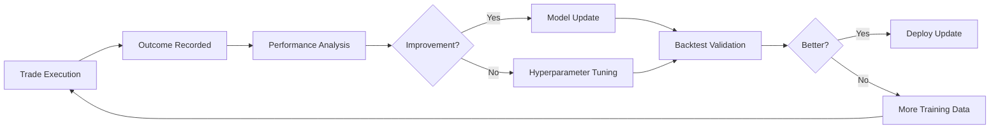

# Transparency & Trust in ReinforceTrade

At ReinforceTrade, we believe that **trust is built through transparency**. Unlike traditional black-box trading systems, we provide complete visibility into how our AI makes decisions, why it takes specific actions, and how it manages risk.

## Our Transparency Principles

### 1. **Black Box Transparency**

Traditional AI trading systems are often opaque - you input money, and you get results, with no understanding of what happened in between. We reject this approach.

**Our Solution**: Every decision made by our system is logged, explained, and visualizable. You can see:
- Which agents suggested what action
- How the Decision Tower weighted each signal
- Why a specific position size was chosen
- What risk factors influenced the decision

### 2. **Explainable AI (XAI)**

Our multi-agent architecture is designed to be interpretable:

```
Decision Process Example:
━━━━━━━━━━━━━━━━━━━━━━━━━━━━━━━━━━━━━━━━
📊 Market Conditions (Environment Agent)
   • Volatility: 0.15 (Moderate)
   • Trend: Bullish
   • Signal: Continue trading

📈 Momentum Analysis (Short-Term Agent)
   • Momentum: +3.2% (Strong upward)
   • Signal: BUY
   • Strength: 85%

🎯 Trend Direction (Trend Agent)
   • MA Crossover: Golden cross
   • Signal: LONG
   • Strength: 72%

🤖 Learned Policy (RL Agent)
   • Historical Success: 78% win rate
   • Action: BUY
   • Confidence: 91%

⚖️ Central Decision Tower
   • Weighted Vote: BUY (Confidence: 82%)
   • Position Size: 8.2% of portfolio
   • Stop Loss: 5%
   • Take Profit: 10%

✅ Trade Executed
━━━━━━━━━━━━━━━━━━━━━━━━━━━━━━━━━━━━━━━━
```

## Multi-Agent Framework: The Trust Engine

### Why Multiple Agents?

A single AI model can develop blind spots or overfit to specific market conditions. By using **specialized agents** that focus on different aspects of market analysis, we:

1. **Reduce single-point failures**: If one agent underperforms, others can compensate
2. **Increase robustness**: Diverse perspectives lead to more balanced decisions
3. **Enable specialization**: Each agent can be optimized for its specific domain
4. **Improve explainability**: It's easier to understand why 3 agents recommended buy vs. why a single model output "buy"

### Agent Decision Transparency

Each agent provides not just a signal, but a confidence score and reasoning:

#### Environment Agent
**What it tells you**: "The market is currently in a bullish regime with moderate volatility (0.15). This is favorable for trend-following strategies but requires careful risk management."

**Metrics provided**:
- Volatility percentile (how volatile compared to history)
- Trend strength measurement
- Market regime classification
- Risk-on/risk-off indicator

#### Short-Term Wave Agent
**What it tells you**: "I detected a momentum surge of 3.2% over the last 4 hours, supported by 150% of average volume. This suggests strong buying pressure."

**Metrics provided**:
- Momentum rate of change
- Volume confirmation ratio
- Support/resistance levels tested
- Timeframe validity

#### Trend Tracking Agent
**What it tells you**: "The 20-day moving average crossed above the 50-day (golden cross) 3 days ago. Historical data shows 68% of such crosses lead to 10%+ gains within 30 days."

**Metrics provided**:
- Moving average alignment
- Support and resistance zones
- Historical pattern match
- Expected duration of trend

#### RL Agent
**What it tells you**: "My policy network, trained on 50,000 hours of market data, assigns a 91% confidence to this buy action based on the current state features."

**Metrics provided**:
- Policy confidence score
- Expected value estimate
- Historical success rate in similar states
- State feature importance

#### ML Factor Engine
**What it tells you**: "The composite factor signal is 0.65 (bullish), driven primarily by momentum (48% contribution) and supported by low volatility regime (weight multiplier: 1.2x)."

**Metrics provided**:
- Per-factor signal contribution and weight breakdown
- Feature importance from sklearn models (RandomForest, GradientBoost)
- Walk-forward validation metrics per time split (accuracy, precision, recall, F1)
- Volatility regime classification and position size adjustment multiplier
- Model metadata: training date, feature names, pipeline type

## Backtest Reports: Complete Transparency

### What You See in Every Report

#### 1. **Performance Metrics Dashboard**
- Total return with daily/weekly/monthly breakdowns
- Risk-adjusted returns (Sharpe, Sortino, Calmar ratios)
- Drawdown analysis with duration and recovery time
- Trade distribution (wins vs. losses, profit distribution)

#### 2. **Decision Log**
Every major decision includes:
- Timestamp
- Market conditions at the time
- Each agent's signal and reasoning
- Final decision and confidence
- Position sizing rationale
- Risk checks performed

#### 3. **Agent Performance Breakdown**
- Individual agent win rates
- Signal accuracy by market regime
- Agent contribution to overall performance
- When each agent was most/least effective

#### 4. **Risk Management Log**
- All stop-losses triggered and why
- Position size adjustments
- Risk limit breaches (if any)
- Drawdown periods and actions taken

### Sample Report Section

```json
{
  "trade_id": 42,
  "timestamp": "2024-01-15T14:30:00Z",
  "symbol": "BTC/USDT",
  "action": "BUY",
  "position_size": 820.00,
  "entry_price": 43250.00,
  
  "agent_decisions": {
    "environment_agent": {
      "signal": "bullish",
      "confidence": 0.78,
      "reasoning": "Volatility at 15th percentile (0.12), trending market detected"
    },
    "short_term_agent": {
      "signal": "buy",
      "confidence": 0.85,
      "reasoning": "3.2% momentum over 4h, volume 150% of average"
    },
    "trend_agent": {
      "signal": "long",
      "confidence": 0.72,
      "reasoning": "Golden cross confirmed, support at 42500 holding"
    },
    "rl_agent": {
      "signal": "buy",
      "confidence": 0.91,
      "reasoning": "Policy predicts 91% probability of positive return"
    }
  },
  
  "decision_tower": {
    "aggregated_action": "buy",
    "final_confidence": 0.82,
    "position_size_rationale": "Kelly sizing with 82% confidence: 8.2% of portfolio"
  },
  
  "risk_checks": {
    "stop_loss": 41087.50,
    "take_profit": 47575.00,
    "max_exposure_ok": true,
    "consecutive_losses": 0,
    "drawdown_impact": "2.1% of portfolio"
  }
}
```

## Protection Mechanisms Explained

### Stop Loss System

**How it works**:
```
Dynamic Stop Loss Calculation:

Base Stop Loss: 5% (default)
  ↓
Volatility Adjustment:
  • Volatility < 2%: Reduce to 4%
  • Volatility 2-10%: Keep at 5%
  • Volatility > 10%: Increase to 7.5%
  ↓
Position Size Adjustment:
  • Larger positions get tighter stops
  • Maximum stop: 10% of entry price
  ↓
Final Stop Price = Entry Price × (1 - Stop Percentage)
```

**Example**:
- Entry: $50,000
- Volatility: 15% (high)
- Adjusted stop: 7.5%
- Stop price: $50,000 × 0.925 = $46,250

### Risk Limits

**Portfolio-Level Controls**:

| Risk Factor | Limit | Action on Breach |
|-------------|-------|------------------|
| Max Position Size | 10% per trade | Reject oversized orders |
| Symbol Exposure | 20% per asset | Force position reduction |
| Portfolio Heat | 50% total exposure | Block new entries |
| Max Drawdown | 20% from peak | Halt all trading |
| Consecutive Losses | 3 in a row | Reduce position size by 50% |

### Circuit Breakers

**Automatic Trading Halts**:

1. **Volatility Spike**: If 24h volatility exceeds 50%, pause new entries for 1 hour
2. **API Failure**: After 3 consecutive failed orders, switch to backup exchange or pause
3. **Drawdown Limit**: At 20% drawdown, require manual intervention to resume
4. **Abnormal Pattern**: If win rate drops below 30% over 20 trades, alert and review

## Self-Improvement: How Agents Learn

### The Feedback Loop



### Continuous Learning Process

**Weekly Cycle**:
1. **Data Collection**: All trades from the past week recorded
2. **Performance Review**: Each agent's accuracy calculated by market regime
3. **Model Retraining**: RL agents retrained on new data
4. **A/B Testing**: New models tested against baseline
5. **Selective Deployment**: Only improvements >5% are deployed

**Monthly Cycle**:
1. **Strategy Optimization**: Genetic algorithm runs on 3 months of data
2. **Parameter Update**: Best parameters from walk-forward validation
3. **Agent Retraining**: Traditional agents retrained on expanded dataset

**Quarterly Cycle**:
1. **Architecture Review**: Evaluate if new agents should be added
2. **Market Regime Analysis**: Check if agents need regime-specific tuning
3. **Risk Parameter Update**: Adjust limits based on recent drawdown experience

## Validation & Testing

### How We Ensure Reliability

#### 1. Walk-Forward Validation

We never optimize on the same data we test on:

```
Month 1-3: Train and optimize
Month 4: Test (out-of-sample)
Month 2-4: Train and optimize
Month 5: Test (out-of-sample)
Month 3-5: Train and optimize
Month 6: Test (out-of-sample)
...
```

Only strategies that perform well on **multiple out-of-sample periods** are deployed.

#### 2. Regime-Specific Testing

Markets behave differently in various regimes. We test separately:
- **Bull markets**: Upward trending, low volatility
- **Bear markets**: Downward trending, high volatility
- **Sideways markets**: Ranging, mean-reverting
- **Crash periods**: Extreme volatility, high correlation

An agent must perform adequately in at least 3 of 4 regimes to be deployed.

#### 3. Stress Testing

Before any update goes live:
- **Flash crash simulation**: 30% drop in 1 hour
- **Liquidity crisis**: Slippage increases 10x
- **API outage**: 4-hour disconnection
- **Correlation breakdown**: All assets move together

Only systems that survive all scenarios are approved.

## Comparing to Traditional Systems

### Traditional Black-Box System
```
User: Why did you sell at that price?
System: The algorithm determined it was optimal.
User: What factors influenced the decision?
System: Multiple factors were considered.
User: Can I see the logic?
System: Proprietary. Trust us.
```

### ReinforceTrade Approach
```
User: Why did you sell at that price?
System: Three agents recommended sell with 82% confidence.
  • Short-Term: Momentum reversal detected (confidence: 85%)
  • Trend: Support level broken (confidence: 78%)
  • RL: Learned pattern from similar crashes (confidence: 91%)
  
User: What factors influenced the decision?
System: Here is the full decision log with all metrics.

User: Can I see the logic?
System: Absolutely. Here is the open-source code and the 
        specific weights used in this decision.
```

## Your Rights as a User

### 1. Right to Understand
You can request an explanation for any decision:
```python
from agents import DecisionTower

# Get full breakdown of last decision
explanation = decision_tower.explain_last_decision()
print(explanation.to_markdown())
```

### 2. Right to Audit
All code is open-source. You can:
- Review agent algorithms
- Verify risk calculations
- Audit backtest results
- Check for biases or flaws

### 3. Right to Customize
Modify any aspect of the system:
```python
# Change agent weights
strategy.decision_tower.set_agent_weights({
    'environment': 0.25,
    'short_term': 0.20,
    'trend': 0.25,
    'rl': 0.30
})

# Adjust risk parameters
risk_manager.max_risk_per_trade = 0.02  # Increase to 2%
```

### 4. Right to Withdraw
At any time, you can:
- Stop the system immediately
- Export all your data
- Switch to manual trading
- Move to a different platform

## Building Trust Through Data

### Our Performance Pledge

1. **No Cherry-Picking**: We report all periods, not just the good ones
2. **No Hidden Fees**: All costs (trading fees, slippage) shown upfront
3. **No Survivorship Bias**: Failed experiments are documented and learned from
4. **No Overfitting**: Every claim is backed by out-of-sample testing

### Historical Performance Disclosure

Every strategy includes:
- **Full backtest history**: All trades, wins and losses
- **Market regime performance**: How it performed in different conditions
- **Maximum drawdown periods**: Worst-case scenarios experienced
- **Recovery times**: How long to recover from drawdowns

## Frequently Asked Questions

### Q: How do I know the agents aren't just curve-fitting?
**A**: We use walk-forward validation and out-of-sample testing. Every strategy is tested on data it was never trained on. Plus, you can see the decision logic - if it's just fitting noise, that will be obvious.

### Q: What if the RL agent learns a bad pattern?
**A**: Multiple safeguards:
1. Risk manager overrides prevent catastrophic losses
2. Regular retraining on recent data prevents overfitting to old patterns
3. A/B testing compares new models against proven baselines
4. Human oversight can disable specific agents if needed

### Q: Can I trust the backtest results?
**A**: Our backtester includes:
- Realistic transaction costs
- Slippage modeling based on volume
- No lookahead bias (can't use future data)
- Monte Carlo simulation for robustness

You can also run your own backtests using our open-source code.

### Q: What happens during market crashes?
**A**: The system has multiple protections:
1. Circuit breakers halt trading at extreme volatility
2. Position sizes are reduced in high-vol regimes
3. Stop losses are widened but enforced
4. Trend agent shifts to "risk-off" mode

See our stress test results for specific scenarios.

### Q: How often do the agents make mistakes?
**A**: We track and report:
- Per-agent accuracy by market regime
- False positive rate (trades that lost money)
- False negative rate (missed opportunities)
- Confidence calibration (does 80% confidence mean 80% win rate?)

All this data is available in your dashboard.

## The Bottom Line

**Trust isn't given. It's earned through transparency.**

We believe that by showing you exactly how our system works - every decision, every calculation, every protection mechanism - you'll have the confidence to use it, customize it, and improve it.

Our goal isn't to replace your judgment with a black box. It's to augment your decision-making with AI that you can understand, verify, and control.

---

**Ready to see it in action?** 
- Run a [backtest](../README.md#quick-start-your-first-backtest) and examine the transparency reports
- Read the [Architecture Guide](architecture.md) to understand the technical details
- Join our community to ask questions and share insights

*Trust through transparency. That's the ReinforceTrade promise.*
